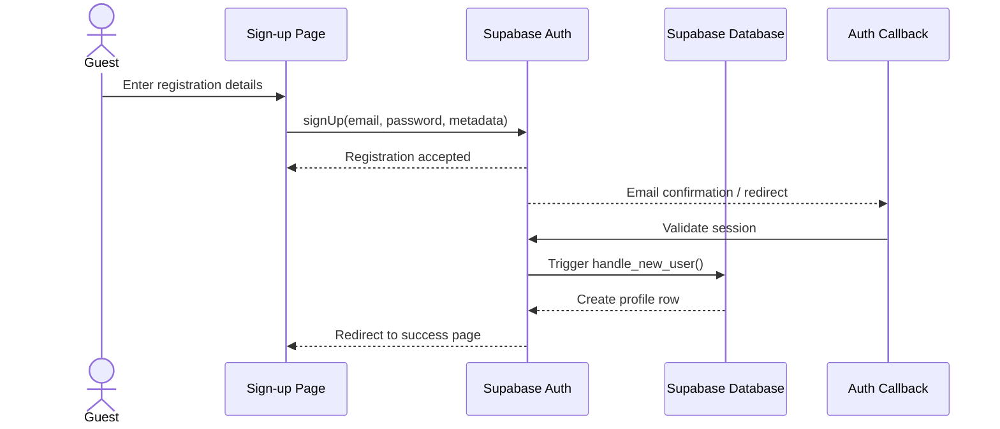
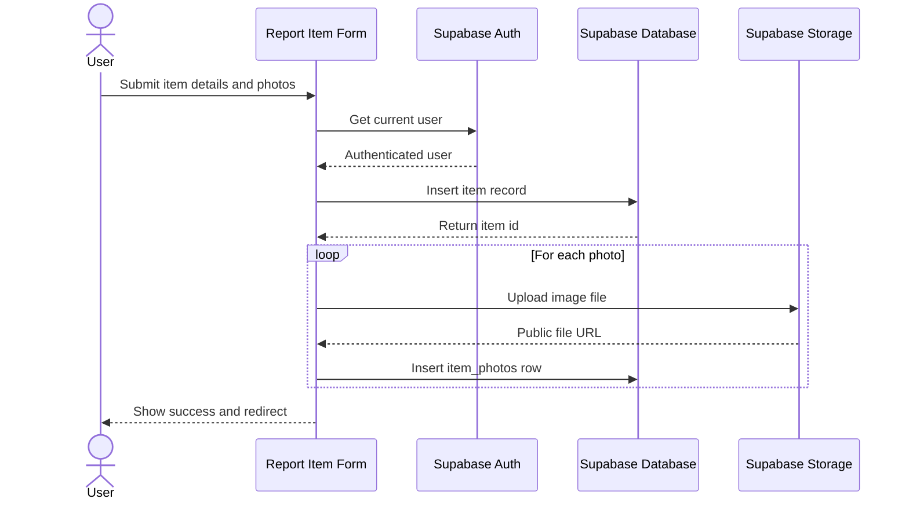
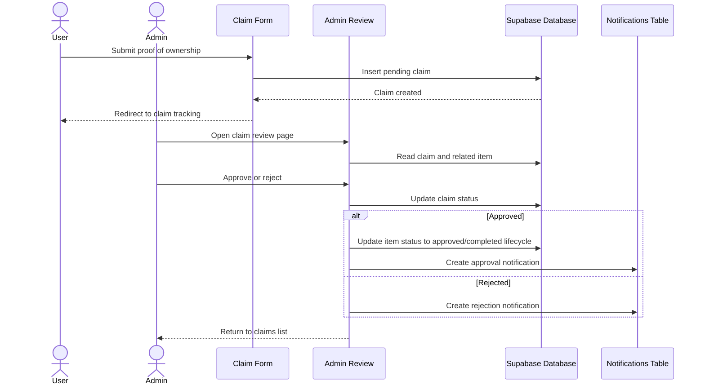
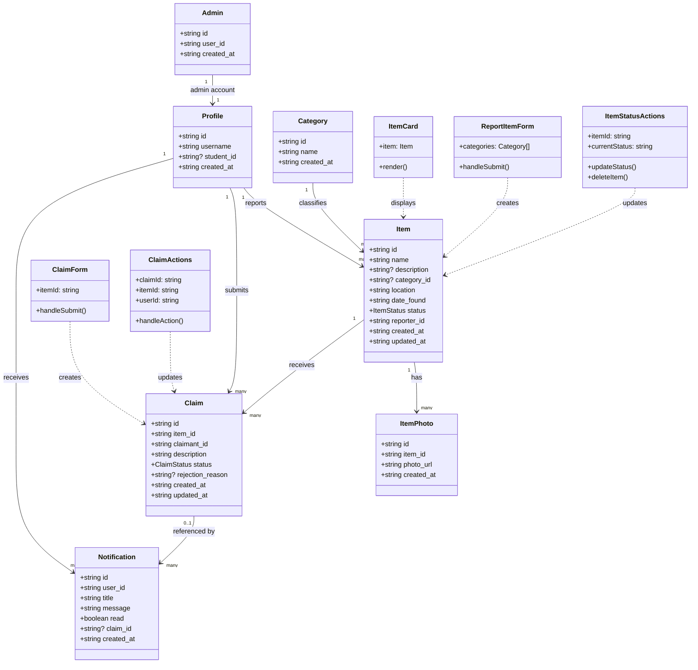

# Lost and Found System Requirements

## 1. Purpose

The Lost and Found System is a campus web application for reporting found items, searching public listings, submitting ownership claims, and reviewing claims through an administrator workflow. The application is implemented with Next.js, React, Supabase, and a component-based UI library.

## 2. Scope

The system supports these core workflows:

## 3. Technical Specification Table

| Category | Component | Minimum | Optimal |
|---|---|---|---|
| Hardware | Development Machine | Modern laptop or desktop | 8 GB RAM or more |
| Hardware | Memory (RAM) | 8 GB | 16 GB |
| Hardware | Storage | 256 GB SSD | 512 GB SSD or more |
| Hardware | Network | Stable broadband connection | Stable broadband with low latency for uploads and admin work |
| Software | Operating System | Windows 10/11, macOS, or Ubuntu | Same, with current stable version |
| Software | Primary Language | TypeScript / JavaScript | TypeScript / JavaScript |
| Software | Framework | Next.js App Router | Next.js App Router |
| Software | React | React 19 | React 19 |
| Software | Package Manager | pnpm | pnpm |
| Software | Version Control | Git | Git |
| Software | Styling | Tailwind CSS | Tailwind CSS |
| Software | Auth SDK | Supabase Auth / SSR helpers | Supabase Auth / SSR helpers |
| Server | Hosting Provider | Vercel hobby tier | Vercel Pro |
| Server | Deployment | Git-based deployment | Git-based deployment with preview environments |
| Server | Runtime | Vercel serverless / Next.js runtime | Vercel serverless / Next.js runtime |
| Server | Monitoring | Basic error tracking | Error tracking, analytics, and uptime monitoring |
| Database | Database Provider | Supabase free tier | Supabase paid tier |
| Database | Engine | PostgreSQL | PostgreSQL |
| Database | Auth/Storage | Supabase Auth + Supabase Storage | Supabase Auth + Supabase Storage |
| Database | Backup/Recovery | Managed backups where available | Automated backups and restore testing |

## 4. User Classes

### 4.1 Guest

- Can view the public item listing
- Can open item details
- Can navigate to sign in or sign up

### 4.2 Registered User

- Can sign in and sign out
- Can report found items
- Can submit and track claims
- Can view personal notifications
- Can browse item listings and apply filters

### 4.3 Admin User

- Can access the admin dashboard
- Can review claims and item details
- Can approve or reject claims
- Can update item status and remove items if required
- Can manage categories and other administrative data

## 5. Functional Requirements

| Area | Requirement |
|---|---|
| Authentication | Users shall be able to sign up, sign in, and sign out using Supabase Auth. |
| Authentication | The system shall create a profile automatically after registration. |
| Authentication | Admin users shall be redirected to the admin dashboard and regular users to the user dashboard. |
| Authentication | The system shall handle email confirmation and auth callback redirection. |
| Authentication | The system shall display authentication errors on login and sign-up pages. |
| User Profile | The system shall store user profile data such as username and student ID. |
| Browse Items | Users shall be able to browse found items from the public dashboard. |
| Browse Items | Users shall be able to search items by keyword in name or description. |
| Browse Items | Users shall be able to filter items by category and status. |
| Browse Items | The dashboard shall show only active items by default. |
| Item Details | Users shall be able to view item details, photos, category, description, location, and date found. |
| Item Reporting | Logged-in users shall be able to report found items. |
| Item Reporting | Users shall be able to provide title, category, description, location, and date found. |
| Item Reporting | Users shall be able to upload item photos. |
| Item Reporting | The system shall allow up to 5 photos per item. |
| Item Reporting | The system shall validate uploaded files as images. |
| Item Reporting | The system shall save item records and photo links in the database. |
| Claims | Logged-in users shall be able to submit claims for active items. |
| Claims | Users shall be required to provide a proof-of-ownership description. |
| Claims | The system shall prevent invalid claims through row-level security and item status checks. |
| Claims | Users shall be able to view the status of their claims. |
| Claims | Claim statuses shall include pending, approved, and rejected. |
| Claims | Users shall be able to see rejection reasons when a claim is rejected. |
| Notifications | The system shall notify users when claim status changes. |
| Notifications | Users shall be able to view unread and read notifications. |
| Notifications | Users shall be able to mark notifications as read. |
| Notifications | The system shall link notifications to claim activity where applicable. |
| Admin Dashboard | Admin users shall be able to access an admin dashboard. |
| Admin Dashboard | Admin users shall be able to view summary statistics for items and claims. |
| Admin Dashboard | Admin users shall be able to review recent pending claims. |
| Admin Items | Admin users shall be able to view all reported items. |
| Admin Items | Admin users shall be able to filter items by status. |
| Admin Items | Admin users shall be able to open item details for management. |
| Admin Claims | Admin users shall be able to view all submitted claims. |
| Admin Claims | Admin users shall be able to filter claims by status. |
| Admin Claims | Admin users shall be able to review claimant information and proof text. |
| Claim Review | Admin users shall be able to approve or reject claims. |
| Claim Review | Admin users shall be able to add optional admin notes. |
| Claim Review | The system shall record the reviewed date and claim decision. |
| Item Management | Admin users shall be able to mark items as completed when returned. |
| Item Management | Admin users shall be able to reset or reopen item status when needed. |
| Item Management | Admin users shall be able to delete an item and its related records. |
| Data Model | The system shall store categories for item classification. |
| Data Model | The system shall store claims, item photos, notifications, and admin records. |
| Security | The system shall use row-level security to protect data. |
| Security | The system shall restrict admin-only pages and actions to authorized admins. |
| Security | The system shall use HTTPS for all client-server communication. |
| Storage | Uploaded photos shall be stored in Supabase Storage. |
| Compatibility | The system shall work on modern desktop and mobile browsers. |
| Usability | The system shall provide clear forms, buttons, loading states, and empty states. |
| Reliability | The system shall handle missing data and loading errors gracefully. |

## 6. Use Cases

### UC-01 Register New User

- **Primary actor:** Guest
- **Goal:** Create a student account and profile
- **Trigger:** Guest selects sign up
- **Preconditions:** None
- **Main flow:**

	1. Guest opens the sign-up page.
	2. Guest enters full name, student ID, email, and password.
	3. The system sends the registration request to Supabase Auth.
	4. The auth callback or confirmation flow completes registration.
	5. The system creates a profile record automatically.
	6. The user is redirected to the post-signup success page or dashboard flow.

- **Postconditions:** Account and profile exist.

### UC-02 Sign In

- **Primary actor:** Registered User
- **Goal:** Access the appropriate dashboard
- **Trigger:** User submits login form
- **Preconditions:** Account exists
- **Main flow:**

	1. User enters email and password.
	2. The system validates credentials through Supabase Auth.
	3. The system checks whether the user is listed in `admins`.
	4. Admin users are redirected to `/admin`.
	5. Non-admin users are redirected to `/dashboard`.

- **Postconditions:** User session is active.

### UC-03 Browse Public Items

- **Primary actor:** Guest or Registered User
- **Goal:** Search and filter found items
- **Trigger:** User opens the dashboard page
- **Preconditions:** Items exist or the system can show an empty state
- **Main flow:**

	1. The system loads active items by default.
	2. The user can search by keyword.
	3. The user can filter by category or status.
	4. The system updates the list and shows matching items.

- **Postconditions:** Matching items are displayed or an empty state is shown.

### UC-04 Report a Found Item

- **Primary actor:** Registered User
- **Goal:** Create an item listing for a found object
- **Trigger:** User opens the report form
- **Preconditions:** User is authenticated
- **Main flow:**

	1. User enters item title, category, description, location, and date found.
	2. User optionally adds up to five photos.
	3. The system creates the item record with status `active`.
	4. The system uploads photos to Supabase Storage.
	5. The system creates photo records linked to the item.

- **Postconditions:** Item is visible in the public listing.

### UC-05 Submit a Claim

- **Primary actor:** Registered User
- **Goal:** Request ownership of a listed item
- **Trigger:** User opens the claim form from an item page
- **Preconditions:** User is authenticated and item is claimable
- **Main flow:**

	1. User opens the item detail page.
	2. User selects claim item.
	3. User enters proof-of-ownership text.
	4. The system creates a pending claim.
	5. The system shows confirmation and redirects the user to claim tracking.

- **Postconditions:** Pending claim exists.

### UC-06 Review Claim

- **Primary actor:** Admin User
- **Goal:** Approve or reject a submitted claim
- **Trigger:** Admin opens a claim detail view
- **Preconditions:** Claim exists and admin session is active
- **Main flow:**

	1. Admin reviews claimant information and proof text.
	2. Admin adds optional notes.
	3. Admin approves or rejects the claim.
	4. The system updates claim status.
	5. If approved, the system updates the item lifecycle and notifies affected users.
	6. If rejected, the system records the decision and notifies the claimant.

- **Postconditions:** Claim status is finalised.

### UC-07 Manage Item Status

- **Primary actor:** Admin User
- **Goal:** Move item through its operational lifecycle
- **Trigger:** Admin opens an item management view
- **Preconditions:** Item exists
- **Main flow:**

	1. Admin marks an approved item as completed when returned.
	2. Admin can reopen or reset a non-final item if needed.
	3. Admin can delete an item and associated records when appropriate.

- **Postconditions:** Item status or record set is updated.

## 7. Sequence Diagrams

### 7.1 Sign Up and Profile Creation

### 7.2 Report Found Item

### 7.3 Submit Claim and Review Decision

## 8. Class Diagram

## 9. Non-Functional Requirements

| Area | Requirement |
|---|---|
| Performance | The system shall load item listings efficiently and use image optimization where available. |
| Reliability | The system shall handle missing records, empty states, and database errors gracefully. |
| Security | The system shall rely on Supabase authentication and row-level security for access control. |
| Usability | The system shall provide clear forms, feedback messages, loading indicators, and empty states. |
| Compatibility | The system shall support modern desktop and mobile browsers. |
| Maintainability | The system shall use reusable UI components and typed data models. |

## 10. Data Model Summary

## 11. Notes and Assumptions

| Claims | Users shall be able to see rejection reasons when a claim is rejected. |
| Notifications | The system shall notify users when claim status changes. |
| Notifications | Users shall be able to view unread and read notifications. |
| Notifications | Users shall be able to mark notifications as read. |
| Notifications | The system shall link notifications to claim activity where applicable. |
| Admin Dashboard | Admin users shall be able to access an admin dashboard. |
| Admin Dashboard | Admin users shall be able to view summary statistics for items and claims. |
| Admin Dashboard | Admin users shall be able to review recent pending claims. |
| Admin Items | Admin users shall be able to view all reported items. |
| Admin Items | Admin users shall be able to filter items by status. |
| Admin Items | Admin users shall be able to open item details for management. |
| Admin Claims | Admin users shall be able to view all submitted claims. |
| Admin Claims | Admin users shall be able to filter claims by status. |
| Admin Claims | Admin users shall be able to review claimant information and proof text. |
| Claim Review | Admin users shall be able to approve or reject claims. |
| Claim Review | Admin users shall be able to add optional admin notes. |
| Claim Review | The system shall record the reviewed date and claim decision. |
| Item Management | Admin users shall be able to mark items as completed when returned. |
| Item Management | Admin users shall be able to reset or reopen item status when needed. |
| Item Management | Admin users shall be able to delete an item and its related records. |
| Data Model | The system shall store categories for item classification. |
| Data Model | The system shall store claims, item photos, notifications, and admin records. |
| Security | The system shall use row-level security to protect data. |
| Security | The system shall restrict admin-only pages and actions to authorized admins. |
| Security | The system shall use HTTPS for all client-server communication. |
| Storage | Uploaded photos shall be stored in Supabase Storage. |
| Compatibility | The system shall work on modern desktop and mobile browsers. |
| Usability | The system shall provide clear forms, buttons, loading states, and empty states. |
| Reliability | The system shall handle missing data and loading errors gracefully. |

## 6. Use Cases

### UC-01 Register New User

- **Primary actor:** Guest
- **Goal:** Create a student account and profile
- **Trigger:** Guest selects sign up
- **Preconditions:** None
- **Main flow:**
	1. Guest opens the sign-up page.
	2. Guest enters full name, student ID, email, and password.
	3. The system sends the registration request to Supabase Auth.
	4. The auth callback or confirmation flow completes registration.
	5. The system creates a profile record automatically.
	6. The user is redirected to the post-signup success page or dashboard flow.
- **Postconditions:** Account and profile exist.

### UC-02 Sign In

- **Primary actor:** Registered User
- **Goal:** Access the appropriate dashboard
- **Trigger:** User submits login form
- **Preconditions:** Account exists
- **Main flow:**
	1. User enters email and password.
	2. The system validates credentials through Supabase Auth.
	3. The system checks whether the user is listed in `admins`.
	4. Admin users are redirected to `/admin`.
	5. Non-admin users are redirected to `/dashboard`.
- **Postconditions:** User session is active.

### UC-03 Browse Public Items

- **Primary actor:** Guest or Registered User
- **Goal:** Search and filter found items
- **Trigger:** User opens the dashboard page
- **Preconditions:** Items exist or the system can show an empty state
- **Main flow:**
	1. The system loads active items by default.
	2. The user can search by keyword.
	3. The user can filter by category or status.
	4. The system updates the list and shows matching items.
- **Postconditions:** Matching items are displayed or an empty state is shown.

### UC-04 Report a Found Item

- **Primary actor:** Registered User
- **Goal:** Create an item listing for a found object
- **Trigger:** User opens the report form
- **Preconditions:** User is authenticated
- **Main flow:**
	1. User enters item title, category, description, location, and date found.
	2. User optionally adds up to five photos.
	3. The system creates the item record with status `active`.
	4. The system uploads photos to Supabase Storage.
	5. The system creates photo records linked to the item.
- **Postconditions:** Item is visible in the public listing.

### UC-05 Submit a Claim

- **Primary actor:** Registered User
- **Goal:** Request ownership of a listed item
- **Trigger:** User opens the claim form from an item page
- **Preconditions:** User is authenticated and item is claimable
- **Main flow:**
	1. User opens the item detail page.
	2. User selects claim item.
	3. User enters proof-of-ownership text.
	4. The system creates a pending claim.
	5. The system shows confirmation and redirects the user to claim tracking.
- **Postconditions:** Pending claim exists.

### UC-06 Review Claim

- **Primary actor:** Admin User
- **Goal:** Approve or reject a submitted claim
- **Trigger:** Admin opens a claim detail view
- **Preconditions:** Claim exists and admin session is active
- **Main flow:**
	1. Admin reviews claimant information and proof text.
	2. Admin adds optional notes.
	3. Admin approves or rejects the claim.
	4. The system updates claim status.
	5. If approved, the system updates the item lifecycle and notifies affected users.
	6. If rejected, the system records the decision and notifies the claimant.
- **Postconditions:** Claim status is finalised.

### UC-07 Manage Item Status

- **Primary actor:** Admin User
- **Goal:** Move item through its operational lifecycle
- **Trigger:** Admin opens an item management view
- **Preconditions:** Item exists
- **Main flow:**
	1. Admin marks an approved item as completed when returned.
	2. Admin can reopen or reset a non-final item if needed.
	3. Admin can delete an item and associated records when appropriate.
- **Postconditions:** Item status or record set is updated.

## 7. Sequence Diagrams

### 7.1 Sign Up and Profile Creation

### 7.2 Report Found Item

### 7.3 Submit Claim and Review Decision

## 8. Class Diagram

## 9. Non-Functional Requirements

| Area | Requirement |
|---|---|
| Performance | The system shall load item listings efficiently and use image optimization where available. |
| Reliability | The system shall handle missing records, empty states, and database errors gracefully. |
| Security | The system shall rely on Supabase authentication and row-level security for access control. |
| Usability | The system shall provide clear forms, feedback messages, loading indicators, and empty states. |
| Compatibility | The system shall support modern desktop and mobile browsers. |
| Maintainability | The system shall use reusable UI components and typed data models. |

## 10. Data Model Summary

- **profiles**: user identity data created from the auth trigger
- **admins**: admin authorization mapping
- **categories**: item classification list
- **items**: found item records and lifecycle status
- **item_photos**: photo URLs linked to items
- **claims**: ownership requests and review outcomes
- **notifications**: user-facing alerts for claim activity

## 11. Notes and Assumptions

- The application is a campus lost-and-found system built with Next.js, React, Supabase, and Vercel.
- The public dashboard shows active items by default, while additional statuses are available through filters and admin workflows.
- The class diagram models both domain entities and the major UI components that drive each workflow.
